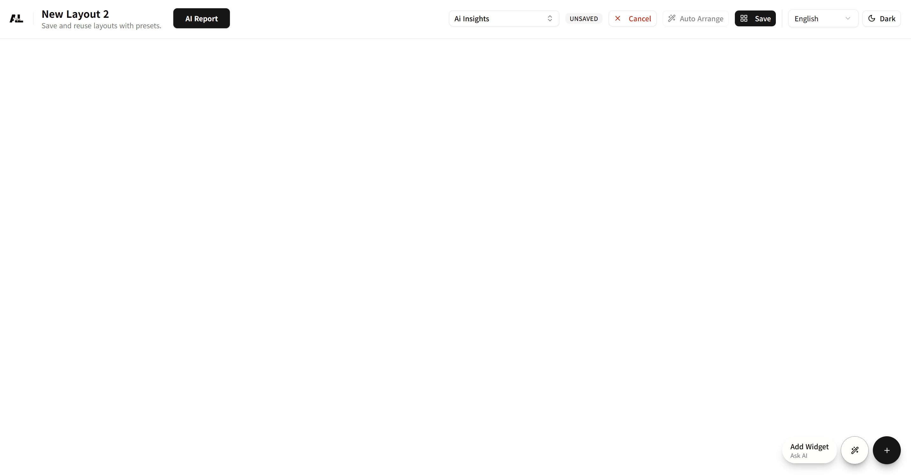

<p align="center">
  
</p>

<h1 align="center">ApiLog</h1>

<p align="center">
  <i>ApiLog 하나로 인사이트를 직접 소유하세요—드롭인 트래킹, 드래그앤드롭 대시보드, 프라이버시 우선 분석을 제품 옆에서 바로 돌릴 수 있습니다.</i>
</p>

<p align="center">
  <a href="README.md">English</a> |
  <a href="README.ko.md"><strong>한국어</strong></a>
</p>

<p align="center">
  <a href="https://apilog.kr" target="_blank" rel="noopener">apilog.kr</a> — 프로젝트 소개 마이크로사이트 &nbsp;•&nbsp;
  <a href="https://demo.apilog.kr" target="_blank" rel="noopener">demo.apilog.kr</a> — 대시보드 데모
</p>
 
---

## 🧭 프로덕트 둘러보기

<p align="center">
  
</p>

- [apilog.kr](https://apilog.kr)에서는 프로젝트 철학, 아키텍처, 온보딩 절차를 한눈에 볼 수 있습니다.
- [demo.apilog.kr](https://demo.apilog.kr)은 샘플 워크스페이스와 연결되어 있어 별도 설정 없이 포틀릿과 프리셋을 체험할 수 있습니다.

---

## 🚀 시작하기

시작에 대한 자세한 내용은 [apilog.kr/docs](https://apilog.kr/docs)를 방문하세요.

---

## 🛠 소스에서 설치

[▶️ 유저 가이드 영상 보기](https://www.youtube.com/watch?v=pPGZDITqLdY)

### 요구 사항

- Docker & Docker Compose (전체 스택 실행 권장)

### 1. 소스 코드 받기

```bash
git clone https://github.com/APIL0g/APILog.git
cd APILog
```

### 2. ApiLog 환경 설정

리포지터리 루트에서 `.env.example`을 `.env`로 복사한 뒤 값을 원하는 대로 조정하세요.

```bash
cp .env.example .env
```

아래 내용은 `.env.example` 파일을 그대로 가져온 것입니다. 기본값이 바뀌면 `.env.example`만 수정하고 다시 복사하면 문서와 환경이 함께 업데이트됩니다.

```ini
# Copy this file to `.env` (e.g. `cp .env.example .env`) and adjust the values.
# 이 파일을 `.env`로 복사한 뒤(`cp .env.example .env`) 환경에 맞게 값을 채워주세요.

############################################################
# Required Settings (필수 설정)
############################################################

# InfluxDB database name where APILog writes/reads analytics events.
# (If you used docker-compose, the default is usually `apilog_db`).
# APILog이 데이터를 저장/조회할 InfluxDB 데이터베이스 이름 (docker-compose 기본값: `apilog_db`).
INFLUX_DATABASE=<Influx Db database name>

# Public base URL of the site you want to snapshot/analyze.
# Example: https://example.com (include protocol, no trailing slash).
# 스냅샷·분석 대상 실서비스의 기본 URL (프로토콜 포함, 마지막 슬래시 제외 권장).
TARGET_SITE_BASE_URL=<your site domain or Ip address>

############################################################
# Optional Settings (선택 설정) — 필요한 경우에만 수정
############################################################

# InfluxDB endpoint (change this only if you host Influx elsewhere)
# docker-compose 기본값으로 충분하다면 수정하지 마세요.
INFLUX_URL=http://influxdb3-core:8181

# CORS allow list (comma separated or * for all origins)
# 다중 도메인은 쉼표로 구분, 전부 허용하려면 *.
CORS_ALLOW_ORIGIN=*

# LLM (Ollama) Settings (used by AI Insights)
# AI Insights에서 사용하는 Ollama 기본 설정입니다.
LLM_PROVIDER=ollama
LLM_ENDPOINT=http://ollama:11434
LLM_MODEL=llama3:8b
LLM_TEMPERATURE=0.2
LLM_TIMEOUT_S=60
LLM_MAX_TOKENS=1024

# AI Report LLM (OpenAI) Settings — leave blank to disable.
# AI Report 기능을 쓰지 않으면 비워두셔도 됩니다.
AI_REPORT_LLM_PROVIDER=openai_compat
AI_REPORT_LLM_ENDPOINT=https://api.openai.com
AI_REPORT_LLM_MODEL=gpt-4.1
# Fill with your OpenAI-compatible API key if you want to enable AI Report.
# AI Report 기능을 쓰려면 OpenAI 호환 API 키를 여기에 입력하세요.
AI_REPORT_LLM_API_KEY=
AI_REPORT_LLM_MAX_TOKENS=4096
AI_REPORT_LLM_TEMPERATURE=0.2
AI_REPORT_LLM_TIMEOUT_S=300

# AI caching / internal API endpoints
# AI 캐시 및 내부 API 엔드포인트 설정입니다.
AI_INSIGHTS_CACHE_TTL=60
AI_INSIGHTS_EXPLAIN_CACHE_TTL=0
AI_REPORT_FETCH_BASE=http://apilog-api:8000

# Where to persist AI-generated dynamic widget specs (JSON file path)
# Docker 환경에서는 /snapshots가 이미 마운트됩니다.
DYNAMIC_WIDGETS_PATH=/snapshots/dynamic_widgets.json

# Optional settings reference (선택 설정 안내)
# - LLM_*: Adjust only for advanced LLM tuning / LLM 동작을 세밀히 조정할 때만 변경
# - AI_INSIGHTS_* / AI_REPORT_FETCH_BASE: Modify when 캐시 정책이나 내부 API 주소를 바꿔야 할 때만 수정하세요.
```

### 3. 애플리케이션 시작

```bash
docker compose up -d --build
```

_기본값으로 `http://<Public IP 주소>:8080`(또는 개발 환경에서는 `localhost`)에서 대시보드에 접속할 수 있습니다._

> ⚠️ **외부 접속 주의**  
> ApiLog 대시보드는 기본적으로 `http://localhost:10000`에서 제공됩니다. 외부에서 접근해야 한다면 `CORS_ALLOW_ORIGIN`을 제한하고 방화벽/보안 그룹에서 10000번 포트를 신뢰하는 IP만 열어 두세요. 예:
> 
> ```bash
> sudo ufw allow from <허용할_IP> to any port 10000 proto tcp
> ```
> 
> 제한 없이 개방하면 분석 데이터가 노출될 수 있습니다.

### 4. 추적 스니펫 삽입

`index.html`의 `<head>` 영역에 아래 로더를 추가하면 ApiLog가 즉시 이벤트를 수집할 수 있습니다.

```html
<!-- Add this to your website's <head> section -->
<script
  src="http://<Public IP or Domain>:8080/apilog/embed.js"
  data-site-id="main"
  data-ingest-url="http://<Public IP or Domain>:8080/api/ingest/events"
  strategy="beforeInteractive"
></script>
```

---

## 🔄 업데이트하기

소스 코드를 최신화하고 다시 빌드하려면:

```bash
git pull
docker compose up --force-recreate -d --build
```

---

## 📚 참고 자료

- **문서** — 자세한 설정과 FAQ는 [apilog.kr/docs](https://apilog.kr/docs)에서 확인하세요.
- **데모 초기화** — `docker compose down -v`로 Influx 볼륨을 지우고 언제든 새로 시작할 수 있습니다.
- **기여 안내** — PR 전에 [CONTRIBUTING.md](CONTRIBUTING.md)를 꼭 읽어 주세요.
- **라이선스** — 프로젝트는 [MIT](LICENSE)로 배포되며 상업적 활용도 허용됩니다.
---
